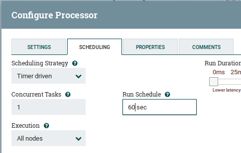
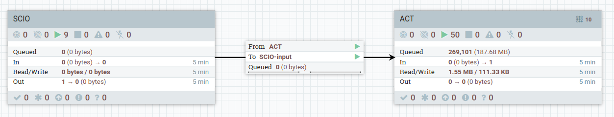
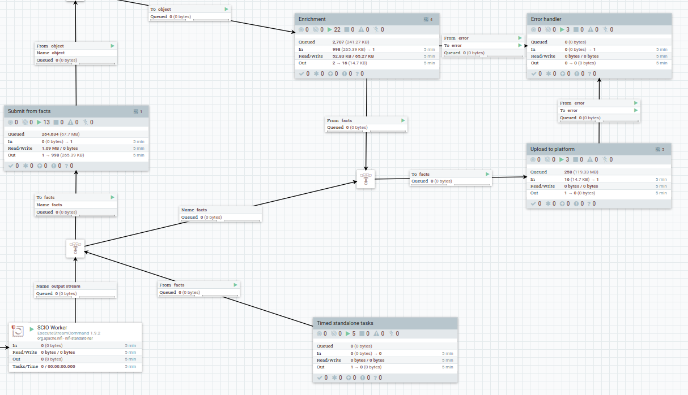
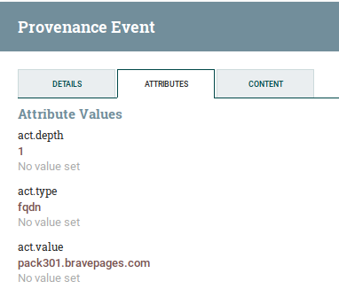

# ACT Virtual Appliance

## About the image

This image is a virtual appliance that can be installed in virtual box or vmware. The image contains a "clean" installation, with only the ACT data model. When booting the image it will start to bootstrap the image with feeds, workers, enrichment and optionally a repository of reports.

The import of data should start immediately after booting the image, but it could take several days to import and enrich everything.

## Download

The image is ~ 19GB and can be downloaded here:

### Version 2019-07-06
* US: [https://act-image-us.s3-us-west-1.amazonaws.com/act-image-2019-07-06.ova](https://act-image-us.s3-us-west-1.amazonaws.com/act-image-2019-07-06.ova)
* Europe: [https://act-image.s3-eu-west-1.amazonaws.com/act-image-2019-07-06.ova](https://act-image.s3-eu-west-1.amazonaws.com/act-image-2019-07-06.ova)

### Version 2019-07-03

* [https://act-image.s3-eu-west-1.amazonaws.com/act-image-2019-07-03.ova](https://act-image.s3-eu-west-1.amazonaws.com/act-image-2019-07-03.ova)

## Image content

The image contains:

* [Centos](https://www.centos.org/)
* [Apache Cassandra](http://cassandra.apache.org/)
* [Elasticsearch](https://www.elastic.co/)
* [Apache NiFI](https://nifi.apache.org/)
* [ACT Platform](https://github.com/mnemonic-no/act-platform)
* [ACT Workers](https://github.com/mnemonic-no/act-workers)
* [ACT SCIO](https://github.com/mnemonic-no/act-scio)
* [ACT SCIO API](https://github.com/mnemonic-no/act-scio-api)
* [ACT Datamodel](https://github.com/mnemonic-no/act-types)
* [ACT Frontend](https://github.com/mnemonic-no/act-frontend)

## Requirements

The minimum requirements for this image are:

* Virtual Box 6, with NAT network
* 10GB RAM
* 4 CPUs
* 60 GB disk

It should also work to install the virtual appliance on vmware, but the port forwarding is not automatically set up after installation, so you will need configure that yourself after importing the image. 

# Usage

## Exposed services

* SSH: localhost:2222
* Web Frontend: [http://localhost:8888](http://localhost:8888)
* NiFi (worker orchestration): [http://localhost:8888/workers/nifi/](http://localhost:8888/workers/nifi/)
* Swagger documentation: [http://localhost:8888/swagger/](http://localhost:8888/swagger/) (Enter "1" in the upper right corner for ACT-User-ID)
* Kibana: [http://localhost:8888/kibana/](http://localhost:8888/kibana/)
* SCIO API: [http://localhost:8888/scio](http://localhost:8888/scio)

# Configuration

## OS

### Login
SSH is port forwarded on port 2222 on localhost.

* user: root
* password: actS3cur3

Change the password and add a personal account after installation.

## ACT workers

Base configuration of the workers is done in `/home/nifi/.config/actworkers/actworkers.ini`. The settings in the `[DEFAULT]` are applied to all workers, and the other sections are used to configure worker specific settings or override the defaults. The default settings should be ok, but here are some change you might want to do:

### HTTP Proxy

If you are behind a HTTP proxy, configure `proxy-string`, which will be used for workers connecting outbound both for HTTP and HTTPS connections:

```bash
[DEFAULT]
proxy-string = http://<proxy-host>:<proxy-port>
```

### Log level

By default, only warnings and errors are included in the logs (`/home/nifi/workerlogs`). If you have any problems, considering reducing the loglevel to `info` or `debug`, either in '[DEFAULT]' or under a specific worker.

```bash
loglevel = info
```
### Virus Total worker

If you have your own Virus Total API key, you can add it here, and comment or remove the `disabled` option in the configuration file:

```
[vt]
# disabled=True
apikey = <INSERT YOUR VIRUS TOTAL API KEY HERE>
```

Since Virus Total API keys are normally rate limited, you will need to make sure the virus total enrichment worker is not running to often. In NifI you will find enrichment for both IPs, Hashes and FQDN. To be on the safe side, you should multiply your rate limit by three and configure that for all these workers. E.g. if your rate limit is 1 query per 20 second, you should configure run schedule to be 60 seconds for all these workers:



### mnemonic Passive DNS worker

The mnemonic passive DNS enrichment worker can be used without an API key, but you will have a low number of requests per minute/day. If you have an API key, add that key to he configuration:

```
[mnemonic-pdns]
pdns-apikey = <INSERT YOUR MNEMONIC pDNS API KEY>
```

## SCIO and SCIO API
SCIO is a tool to extract indicators from reports (pdf, docx, html, etc.) using a combination of natural language processing, regular expression and vocabularies.

SCIO and SCIO API configuration can be found in `/opt/scio/etc/scio.ini` and you should not need to change these settings in the default image, but you can for instance change number of workers to process documents (default=2).

Although indicators of processed documents from SCIO will end up in ACT, you can also view the details directly in kibana ([http://localhost:8888/kibana/](http://localhost:8888/kibana)).


## SCIO Feeds

To feed SCIO with data there are scripts that will download content from RSS feeds and blog posts and send to SCIO.

To change the feeds, edit `/opt/scio_feeds/feeds.txt`:

* If the article is in the actual feed (a full feed), Add a line starting with "f" followed by a space and then the full URL of the feed
* If the feed contains stub articles (only linking to the actual article), add a line starting with "p" followed by a space and then the full URL of the feed

```bash
$ crontab -u act -l
# Feeds
34 * * * * /opt/scio_feeds/run.sh

# Download Veris references to /opt/scio_feeds/pdf
17 * * * * /opt/scio_feeds/download-veris-pdf-ref.sh

# Report repositories
# 55 * * * * /opt/auto_report_download/run.sh
```
If you are behind a http proxy add your proxy settings at the top of each of the files referenced in cron.

## NiFi

Apache NiFi supports data ingestion, routing and transformation. A full introduction to NiFi will not be given here, but we will provide a starting point to make it easier to investigate the worker orchestration.

For the default setup you will not need to do any configuration in NiFi, all configuration for the workers are done at the OS level in `/home/nifi/.config/actworkers/actworkers.ini`. However, here are some starting points if you would like to make any changes.

In this image, NiFi is used by both ACT and SCIO.

* SCIO
    - Ingest output from SCIO backend
    - Insert scio documents to elasticsearch
    - Forward scio documents to ACT
* ACT
    - Run standalone workers:
        - MISP feeds
        - Mitre ATT&CK,
        - Country/Region,
        - Veris Community Database
    - Enrich fqdn, ip, hexdigest and URLs using:
        - Shadowserver ASN lookup
        - Virus Total (requires api key)
        - Unpack url shorteners
        - mnemonic passiveDNS


### Configuration
Log in to NiFi ([http://localhost:8888/workers/nifi/](http://localhost:8888/workers/nifi/)) to configure the worker workflow.

Here you will see two processor groups:



Double click on the ACT processor group to look at the workflow for ACT workers.



The main processor groups involved are:

* Time standalone tasks (MISP, ATT&CK, etc)
* Enrichment (ASN enrichment, pDNS enrichment)
* Upload (Upload of facts to the platform)

## nginx

The nginx configuration is set up as a reverse proxy in front of the core platform, NiFi, scio and are also serving the front end.

The configuration should be ok by default, but if you need to do any changes, you can find the configuration in `/etc/nginx/conf.d/nginx-act.conf`.

# Troubleshooting

## Logs

Relevant logs are available here:

* ACT Platform: /home/act/logs
* Workers: /home/nifi/workerlogs
* SCIO: syslog

## NiFi provenance

NiFi includes a repository of all facts and enrichment performed by workers. You can inspect this repository by right clicking on a processor and click on `View data provenance`. Click on the (i) icon on the row, and you can inspect the attributes and content of the flow file:


